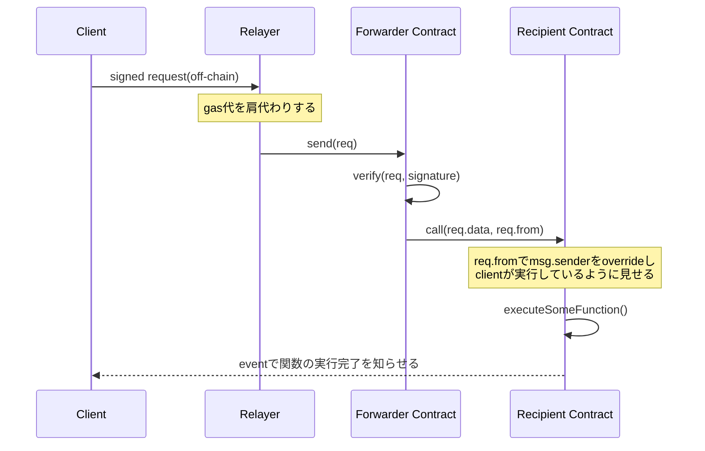

# Meta Transaction

## 目次

### 1. [はじめに](#1-はじめに-1)

### 2. [meta transaction とは](#2-meta-transactionとは-1)

### 3. 対象ファイル

1. [ERC2771Context.sol](#31-erc2771contextsol)
2. [draft-EIP712.sol](#31-erc2771contextsol)
3. [MinimalForwarder.sol](#33-minimalforwardersol)

### 4. [relayer について(おまけ)](#4-relayerについておまけ-1)

## 1. はじめに

ここでは、openzeppelin の[metatx](https://github.com/OpenZeppelin/openzeppelin-contracts/tree/master/contracts/metatx)のディレクトリのファイルとそこにインポートされている主要なファイルについてコードを読み、metatx を理解することを目指します。

このディレクトリ(metatx)の内容は、以下の図 1 の**forwarder**と**recipient**の範囲となっています。relayer をどのように実現するかは様々な方法がありますが、別途検討する必要があります。

README では各ファイルが担うの主な機能を伝え、実装の解説は各ファイルのコメントに任せます。

また、まだ力不足で理解が及んでいない箇所は`TODO`としています。どんどん修正を加えていただけますと幸いです。

## 2. Meta Transaction とは

一言で言うとユーザーは gas 代を支払うことなく transaction を発行するための仕組みです。具体的には client と contract の間に relayer を挟み、gas 代を肩代わりすることでこの仕組みを実現します。

図 1.metatx の流れ

この仕組みを実現しようとした時に、次のような疑問が思い浮かぶと思います。

- transaction を発行するのが client ではなくなると sender の`address`がわからなくなるのではないか？
- sender が正しいことを証明することはできるのだろうか？

これらの疑問を解決するための仕組みがそれぞれ`ERC2771Context.sol`, `draft-EIP712.sol`に備わっています。

※以下で client, relayer, forwarder, recipient という word を使用する際は、この図 1 の内容を指します。

## 3.1 ERC2771Context.sol

参照元: https://github.com/OpenZeppelin/openzeppelin-contracts/blob/master/contracts/metatx/ERC2771Context.sol

こちらのファイルは EIP-2771(https://eips.ethereum.org/EIPS/eip-2771) で定義されている規格の抽象コントラクトです。このコントラクトは上記の recipient にあたる Contract に継承させ使用します。

機能としては主に以下の 3 つを提供します。

### 1. forwarder が trusted なものか確認する

`constructor`で forwader の`address`を set し、その値と`msg.sender`が等しいかを`isTrustedForwarder(msg.sender)`で比較する。これにより、trusted な forwarder からの transaction なのかどうかを判断します。

### 2. \_msgSender を上記の図 1 の client の address で override

`msg.sender`が trusted forwarder であれば、client の address を\_msgSender()から返します。そうでない場合は、`msg.sender`をそのまま返します。

recipient contract から`_msgSender()`を呼ぶことで、このトランザクションを実行したい人(client)が誰なのかを知ることができます。

### 3. \_msgData を余分なデータを取り除いたデータで override

`msg.sender`が trusted forwarder であれば、msg.data から余分なデータ(client address)を取り除いて返します。そうでない場合は、`msg.data`をそのまま返します。

forwarder から recipient の関数を実行する際に data の末尾に client の address を付与しているので、元々の純粋な data はその address を除いたものになります。

## 3.2 draft-EIP712.sol

参照元: https://github.com/OpenZeppelin/openzeppelin-contracts/blob/master/contracts/utils/cryptography/draft-EIP712.sol

こちらのファイルは EIP-712(https://eips.ethereum.org/EIPS/eip-712) で定義されている規格の抽象コントラクトです。EIP-712 は構造体に署名をつけることができる規格です。draft-EIP712.sol では構造体を encode する機能を提供します。

この際に単純に構造体を encode するだけだと、異なる 2 つの DApp が同一の構造体を使用する場合に一方の DApp を対象にした署名付きメッセージが、もう一方でも有効になってしまうということが起こり得ます。そのため、DApp 毎に異なるドメイン固有の値を含めて encode する必要があり、その仕組みを実装しています。

## 3.3 MinimalForwarder.sol

参照元: https://github.com/OpenZeppelin/openzeppelin-contracts/blob/master/contracts/metatx/MinimalForwarder.sol

こちらのファイルは forwarder として機能するコントラクトです。しかしながらあくまでテスト用という位置付けで、実運用をするためには機能が不十分とされています。
機能としては主に以下の 3 つを提供します。

### 1. nonce の管理

client の`address`毎に nonce を保持し、関数を実行するたびに increment します。また nonce を取得するための`getNonce()`を備えており、フロントエンドからに最新の nonce を取得し、request に含めることができます。これにより、request の nonce と contract で保持している nonce が等しいことを比較することが可能になり、[replay attack](https://medium.com/cypher-core/replay-attack-vulnerability-in-ethereum-smart-contracts-introduced-by-transferproxy-124bf3694e25)を防ぐことができます。

### 2. 署名の検証

draft-EIP712、[ECDSA](https://github.com/OpenZeppelin/openzeppelin-contracts/blob/master/contracts/utils/cryptography/ECDSA.sol)の関数を使用し、encode された EIP712 のメッセージのハッシュ値から取得する署名と、`verify`関数の引数の署名が等しいことを検証します。

### 3. recipient の関数の実行

署名の検証に成功したら、nonce を increment し、data の末尾に client の`address`を付与して、関数を実行します。

## 4. relayer について(おまけ)

OpenZeppelin は defender(https://defender.openzeppelin.com) というサービスを提供しており、こちらを活用することで簡単に実装することができます。
