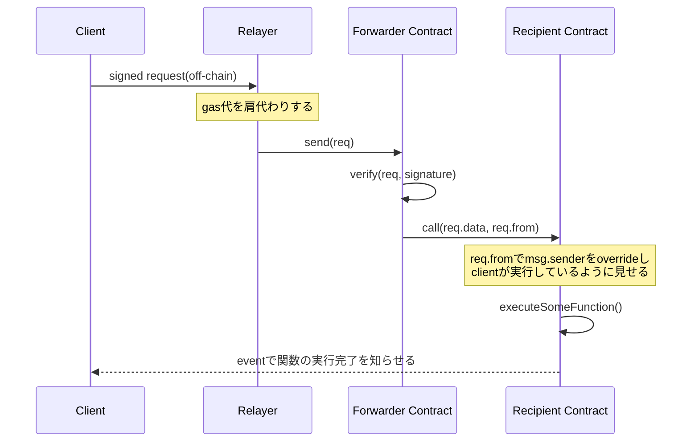

# Meta Transaction
## 目次
### 1. [はじめに](#1-はじめに-1)
### 2. [meta transactionとは](#2-meta-transactionとは-1)
### 3. 対象ファイル
1. [ERC2771Context.sol](#31-erc2771contextsol)
2. [draft-EIP712.sol](#31-erc2771contextsol)
3. [MinimalForwarder.sol](#33-minimalforwardersol)
### 4. [relayerについて(おまけ)](#4-relayerについておまけ-1)

## 1. はじめに
ここでは、openzeppelinの[metatx](https://github.com/OpenZeppelin/openzeppelin-contracts/tree/master/contracts/metatx)のディレクトリのファイルとそこにインポートされている主要なファイルについてコードを読み、metatxを理解することを目指します。

このディレクトリ(metatx)の内容は、以下の図1の**forwarder**と**recipient**の範囲となっています。relayerをどのように実現するかは様々な方法がありますが、別途検討する必要があります。

READMEでは各ファイルが担うの主な機能を伝え、実装の解説は各ファイルのコメントに任せます。

また、まだ力不足で理解が及んでいない箇所は`TODO`としています。どんどん修正を加えていただけますと幸いです。

## 2. Meta Transactionとは
一言で言うとユーザーはgas代を支払うことなくtransactionを発行するための仕組みです。具体的にはclientとcontractの間にrelayerを挟み、gas代を肩代わりすることでこの仕組みを実現します。

図1.metatxの流れ

この仕組みを実現しようとした時に、次のような疑問が思い浮かぶと思います。
- transactionを発行するのがclientではなくなるとsenderの`address`がわからなくなるのではないか？
- senderが正しいことを証明することはできるのだろうか？

これらの疑問を解決するための仕組みがそれぞれ`ERC2771Context.sol`, `draft-EIP712.sol`に備わっています。

※以下でclient, relayer, forwarder, recipientというwordを使用する際は、この図1の内容を指します。

## 3.1 ERC2771Context.sol
参照元: https://github.com/OpenZeppelin/openzeppelin-contracts/blob/master/contracts/metatx/ERC2771Context.sol

こちらのファイルはEIP-2771(https://eips.ethereum.org/EIPS/eip-2771) で定義されている規格の抽象コントラクトです。このコントラクトは上記のrecipientにあたるContractに継承させ使用します。

機能としては主に以下の3つを提供します。

### 1. forwarderがtrustedなものか確認する
`constructor`でforwaderの`address`をsetし、その値と`msg.sender`が等しいかを`isTrustedForwarder(msg.sender)`で比較する。これにより、trustedなforwarderからのtransactionなのかどうかを判断します。

### 2. _msgSenderを上記の図1のclientのaddressでoverride
`msg.sender`がtrusted forwarderであれば、clientのaddressを_msgSender()から返します。そうでない場合は、`msg.sender`をそのまま返します。

recipient contractから`_msgSender()`を呼ぶことで、このトランザクションを実行したい人(client)が誰なのかを知ることができます。

### 3. _msgDataを余分なデータを取り除いたデータでoverride
`msg.sender`がtrusted forwarderであれば、msg.dataから余分なデータ(client address)を取り除いて返します。そうでない場合は、`msg.data`をそのまま返します。

forwarderからrecipientの関数を実行する際にdataの末尾にclientのaddressを付与しているので、元々の純粋なdataはそのaddressを除いたものになります。

## 3.2 draft-EIP712.sol
参照元: https://github.com/OpenZeppelin/openzeppelin-contracts/blob/master/contracts/utils/cryptography/draft-EIP712.sol

こちらのファイルはEIP-712(https://eips.ethereum.org/EIPS/eip-712) で定義されている規格の抽象コントラクトです。EIP-712は構造体に署名をつけることができる規格です。draft-EIP712.solでは構造体をencodeする機能を提供します。

この際に単純に構造体をencodeするだけだと、異なる2つのDAppが同一の構造体を使用する場合に一方のDAppを対象にした署名付きメッセージが、もう一方でも有効になってしまうということが起こり得ます。そのため、DApp毎に異なるドメイン固有の値を含めてencodeする必要があり、その仕組みを実装しています。

## 3.3 MinimalForwarder.sol
参照元: https://github.com/OpenZeppelin/openzeppelin-contracts/blob/master/contracts/metatx/MinimalForwarder.sol

こちらのファイルはforwarderとして機能するコントラクトです。しかしながらあくまでテスト用という位置付けで、実運用をするためには機能が不十分とされています。
機能としては主に以下の3つを提供します。

### 1. nonceの管理
clientの`address`毎にnonceを保持し、関数を実行するたびにincrementします。またnonceを取得するための`getNonce()`を備えており、フロントエンドからに最新のnonceを取得し、requestに含めることができます。これにより、requestのnonceとcontractで保持しているnonceが等しいことを比較することが可能になり、[replay attack](https://medium.com/cypher-core/replay-attack-vulnerability-in-ethereum-smart-contracts-introduced-by-transferproxy-124bf3694e25)を防ぐことができます。

### 2. 署名の検証
draft-EIP712、[ECDSA](https://github.com/OpenZeppelin/openzeppelin-contracts/blob/master/contracts/utils/cryptography/ECDSA.sol)の関数を使用し、encodeされたEIP712のメッセージのハッシュ値から取得する署名と、`verify`関数の引数の署名が等しいことを検証します。

### 3. recipientの関数の実行
署名の検証に成功したら、nonceをincrementし、dataの末尾にclientの`address`を付与して、関数を実行します。

## 4. relayerについて(おまけ)
OpenZeppelinはdefender(https://defender.openzeppelin.com) というサービスを提供しており、こちらを活用することで簡単に実装することができます。
